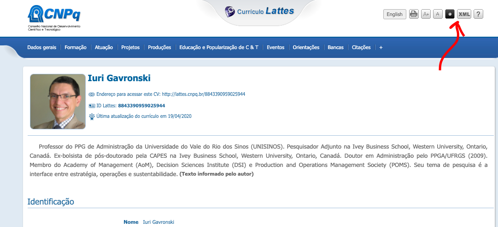

# lattes2csv
Extrai dados do currículo Lattes no formato XML para o formato CSV (pode ser aberto no Excel)

## Motivação

Todos os anos toda a academia brasileira investe um bocado de tempo reportando o que faz para os órgãos de controle, tanto internos às universidades quanto os externos, como a CAPES. Além de cada um cadastrar as suas atividades no Lattes, que tem uma interface gráfica, totalmente avessa às pessoas com dificuldade de usar o mouse (como eu), todos os anos e no final dos quadriênios, precisamos extrair informações dos CVs Lattes e fazer análises.

Tais análises não estão acessíveis facilmente, fazendo com que muitos pesquisadores precisem redigitar os dados do Lattes para planilhas. Esses pequenos scripts em Python servem para converter os dados do Lattes para um formato mais amigável (CSV), que pode ser importado diretamente para o Lattes.

## Como usar

Primeiramente, é preciso instalar o Python no computador que vai fazer essa conversão. Os programas foram escritos em Python 3. Ver as instruções de instalação para o sistema operacional utilizado no seu computador utilizando seu sistema de busca favorito.

Os scripts foram propositalmente escritos apenas com as bibliotecas básicas do Python, não requerendo a instalação de bibliotecas adicionais.

Abra os CVs Lattes das pessoas das quais você deseja exportar os dados, conforme figura abaixo:



Clicando no botão XML, no topo da página, irá baixar um arquivo zip. Dentro do arquivo zip terá apenas um arquivo, chamado 'curriculo.xml'. Salve todos os zips de interesse em uma pasta.

Descompacte o zip e rode o script no diretório onde está o arquivo 'curriculo.xml'. O script vai ler o curriculo.xml e gravar um arquivo \[id do Lattes].csv. No final, esses arquivos csv podem ser todos concatenados manualmente ou abertos diretamente no Excel.

## Produção Científica e Produção Técnica

O script que extrai a produção científica é o **lattesprd.py**. Já a produção técnica é extraída com o script **lattesprdt.py**.

Para acelerar a extração dos dados com esses scripts, eu salvo todos os CVs de interesse (os zips) numa pasta e faço todas as extrações de uma única vez. Eu utilizo o Ubuntu para Windows 10, creio que no terminal do Mac OS seja semelhante:
```
cd quadrienio/Lattes
for f in *.zip; do unzip -o $f; lattesprd.py; done
cat *.csv ../producao.csv
for f in *.zip; do unzip -o $f; lattesprdt.py; done
cat *.csv ../tecnica.csv
```
